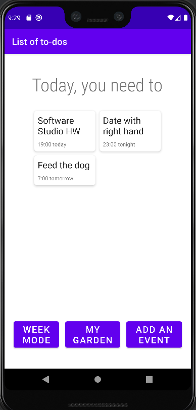
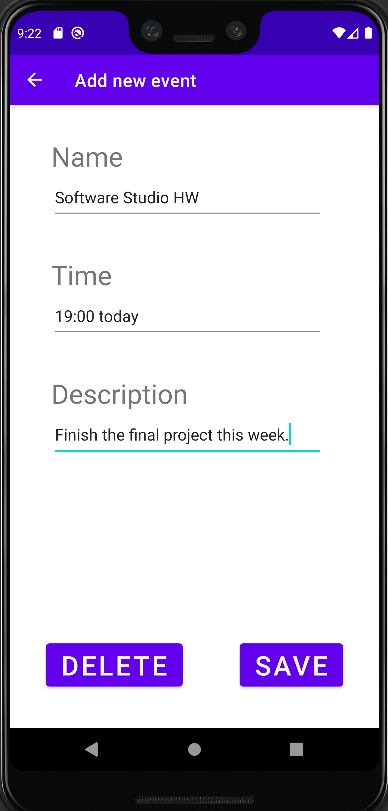
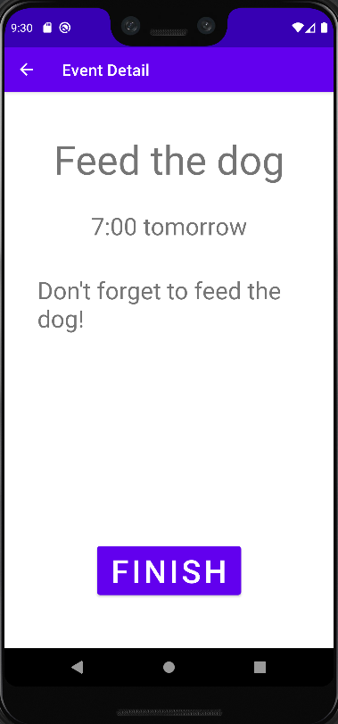
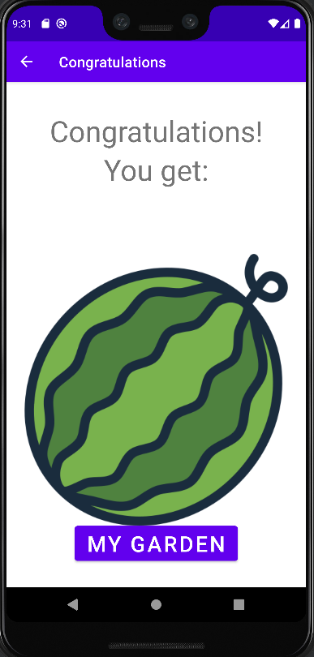
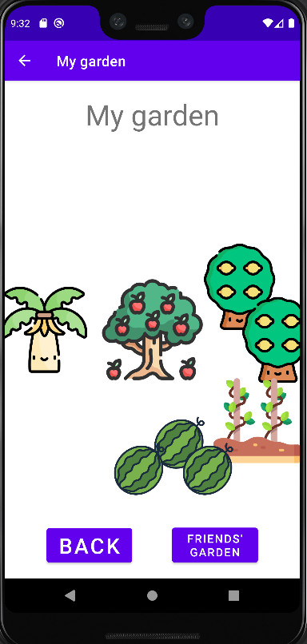

# Android Project: A Week Planner for Weed Planter

## Authors
This project exists thanks to all the people who contribute. 
* [Leo](https://leothebestcoder.github.io/)
* [Daybreak](https://github.com/everace2021)
* [Bowen](https://github.com/bowen1248)
* [Christine](https://github.com/christinewct)


## Getting Started
1. Clone our project
    ```
    git clone https://github.com/LeoTheBestCoder/weed-planter
    ```
1. Change directory into `weed-planter/server`
    ```
    cd weed-planter/server
    ```
1. Launch the server ([Node.js](https://nodejs.org/en/) required)
    ```
    npm start
    ```
1. Launch [Android Studio](https://developer.android.com/studio) and run the app

## App Overview

1. Home page (to-do list **today**)




1. Add an event




2. Detailed description of an event




3. Get a random rewad after finishing an event




4. My garden (So beautiful, isn't it?)



## Contributions
Pull requests are always welcome!

All code is licensed under the [MIT License](https://github.com/LeoTheBestCoder/weed-planter/blob/main/LICENSE).